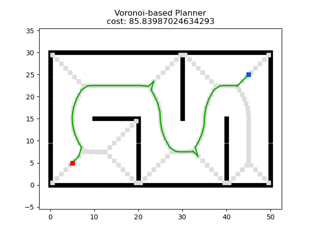
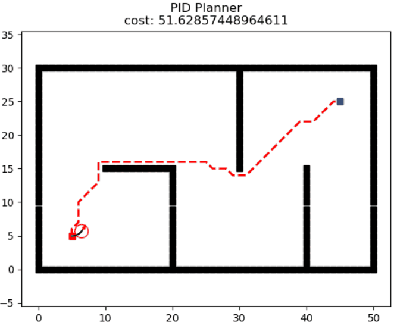
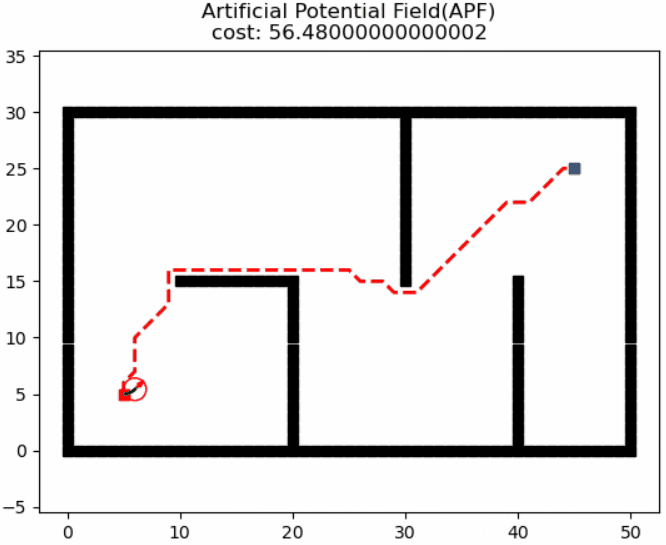
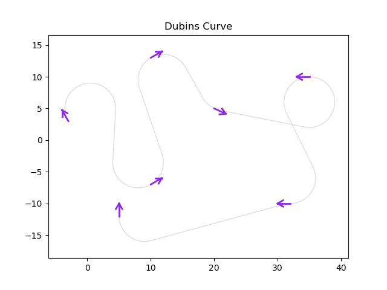

# Introduction

`Motion planning` plans the state sequence of the robot without conflict between the start and goal. 

`Motion planning` mainly includes `Path planning` and `Trajectory planning`.

* `Path Planning`: It's based on path constraints (such as obstacles), planning the optimal path sequence for the robot to travel without conflict between the start and goal.
* `Trajectory planning`: It plans the motion state to approach the global path based on kinematics, dynamics constraints and path sequence.

This repository provides the implement of common `Motion planning` algorithm, welcome your star & fork & PR.

The theory analysis can be found at [motion-planning](https://blog.csdn.net/frigidwinter/category_11410243.html)

We also provide [ROS C++](https://github.com/ai-winter/ros_motion_planning) version and [Matlab](https://github.com/ai-winter/matlab_motion_planning) version.
# Quick Start
The file structure is shown below

```
python_motion_planning
├─gif
├─example
├─global_planner
│   ├─graph_search
│   ├─sample_search
│   └─evolutionary_search
├─local_planner
├─curve_generation
├─utils
└─main.py
```
* The global planning algorithm implementation is in the folder `global_planner` with `graph_search`, `sample_search` and `evolutionary search`.
* The local planning algorithm implementation is in the folder `local_planner`.
* The curve generation algorithm implementation is in the folder `curve_generation`.

To start simulation, open the folder `example` and select the algorithm, for example

```python
if __name__ == '__main__':
    '''
    path searcher constructor
    '''
    search_factory = SearchFactory()
    
    '''
    graph search
    '''
    # build environment
    start = (5, 5)
    goal = (45, 25)
    env = Grid(51, 31)

    # creat planner
    planner = search_factory("a_star", start=start, goal=goal, env=env)
    # animation
    planner.run()
```

# Version
## Global Planner

Planner      |   Version   | Animation
------------ | --------- | --------- 
**GBFS**              | [](https://github.com/ai-winter/python_motion_planning/blob/master/global_planner/graph_search/gbfs.py)   |  
**Dijkstra**                 | [](https://github.com/ai-winter/python_motion_planning/blob/master/global_planner/graph_search/dijkstra.py) | 
**A***               | [](https://github.com/ai-winter/python_motion_planning/blob/master/global_planner/graph_search/a_star.py) |   
**JPS**                 | [](https://github.com/ai-winter/python_motion_planning/blob/master/global_planner/graph_search/jps.py) | 
**D***                  | [](https://github.com/ai-winter/python_motion_planning/blob/master/global_planner/graph_search/d_star.py) | 
**LPA***                 | [](https://github.com/ai-winter/python_motion_planning/blob/master/global_planner/graph_search/lpa_star.py) |  
**D\* Lite**                | [](https://github.com/ai-winter/python_motion_planning/blob/master/global_planner/graph_search/d_star_lite.py) | 
**Theta\***                | [](https://github.com/ai-winter/python_motion_planning/blob/master/global_planner/graph_search/theta_star.py) | 
**Lazy Theta\***                | [](https://github.com/ai-winter/python_motion_planning/blob/master/global_planner/graph_search/lazy_theta_star.py) | 
**Voronoi**                | [](https://github.com/ai-winter/python_motion_planning/blob/master/global_planner/graph_search/voronoi.py) |  
**RRT**                 | [](https://github.com/ai-winter/python_motion_planning/blob/master/global_planner/sample_search/rrt.py) | 
**RRT***                 | [](https://github.com/ai-winter/python_motion_planning/blob/master/global_planner/sample_search/rrt_star.py) | 
**Informed RRT**                 | [](https://github.com/ai-winter/python_motion_planning/blob/master/global_planner/sample_search/informed_rrt.py) | 
**RRT-Connect**                | [](https://github.com/ai-winter/python_motion_planning/blob/master/global_planner/sample_search/rrt_connect.py) | 
| **ACO** | [](https://github.com/ai-winter/python_motion_planning/blob/master/global_planner/evolutionary_search/aco.py) | 
| **GA**  |  |  
| **PSO**  |  |  


## Local Planner
| Planner |  Version   | Animation                                     
| ------- | ---------------------------------------- | -------------------------------------------------- 
| **PID** | [](https://github.com/ai-winter/python_motion_planning/blob/master/local_planner/pid.py) |  
| **APF** |[](https://github.com/ai-winter/python_motion_planning/blob/master/local_planner/apf.py) |  
| **DWA** |   |  
| **TEB** |  |  
| **MPC** |  |  
| **Lattice** |  |

## Curve Generation

| Planner | Version   | Animation                                |
| ------- | -------------------------------------------------------- | -------------------------------------------------------- 
| **Polynomia** | [](https://github.com/ai-winter/python_motion_planning/blob/master/curve_generation/polynomial_curve.py) | 
| **Bezier** | [](https://github.com/ai-winter/python_motion_planning/blob/master/curve_generation/bezier_curve.py) | 
| **Cubic Spline** | [](https://github.com/ai-winter/python_motion_planning/blob/master/curve_generation/cubic_spline.py) | 
| **BSpline** | [](https://github.com/ai-winter/python_motion_planning/blob/master/curve_generation/bspline_curve.py) | 
| **Dubins** | [](https://github.com/ai-winter/python_motion_planning/blob/master/curve_generation/dubins_curve.py) | 
| **Reeds-Shepp** | [](https://github.com/ai-winter/python_motion_planning/blob/master/curve_generation/reeds_shepp.py) | 


# Papers
## Global Planning
* [A*: ](https://ieeexplore.ieee.org/document/4082128) A Formal Basis for the heuristic Determination of Minimum Cost Paths
* [JPS:](https://ojs.aaai.org/index.php/AAAI/article/view/7994) Online Graph Pruning for Pathfinding On Grid Maps
* [Lifelong Planning A*: ](https://www.cs.cmu.edu/~maxim/files/aij04.pdf) Lifelong Planning A*
* [D*: ](http://web.mit.edu/16.412j/www/html/papers/original_dstar_icra94.pdf) Optimal and Efficient Path Planning for Partially-Known Environments
* [D* Lite: ](http://idm-lab.org/bib/abstracts/papers/aaai02b.pdf) D* Lite
* [Theta*: ](https://www.jair.org/index.php/jair/article/view/10676) Theta*: Any-Angle Path Planning on Grids
* [Lazy Theta*: ](https://ojs.aaai.org/index.php/AAAI/article/view/7566) Lazy Theta*: Any-Angle Path Planning and Path Length Analysis in 3D
* [RRT: ](http://msl.cs.uiuc.edu/~lavalle/papers/Lav98c.pdf) Rapidly-Exploring Random Trees: A New Tool for Path Planning
* [RRT-Connect: ](http://www-cgi.cs.cmu.edu/afs/cs/academic/class/15494-s12/readings/kuffner_icra2000.pdf) RRT-Connect: An Efficient Approach to Single-Query Path Planning
* [RRT*: ](https://journals.sagepub.com/doi/abs/10.1177/0278364911406761) Sampling-based algorithms for optimal motion planning
* [Informed RRT*: ](https://arxiv.org/abs/1404.2334) Optimal Sampling-based Path Planning Focused via Direct Sampling of an Admissible Ellipsoidal heuristic
* [ACO: ](http://www.cs.yale.edu/homes/lans/readings/routing/dorigo-ants-1999.pdf) Ant Colony Optimization: A New Meta-Heuristic

## Local Planning

* [DWA: ](https://www.ri.cmu.edu/pub_files/pub1/fox_dieter_1997_1/fox_dieter_1997_1.pdf) The Dynamic Window Approach to Collision Avoidance
* [APF: ](https://ieeexplore.ieee.org/document/1087247)Real-time obstacle avoidance for manipulators and mobile robots

## Curve Generation
* [Dubins: ]() On curves of minimal length with a constraint on average curvature, and with prescribed initial and terminal positions and tangents

# Acknowledgment
* Our visualization and animation framework of Python Version refers to [https://github.com/zhm-real/PathPlanning](https://github.com/zhm-real/PathPlanning). Thanks sincerely.