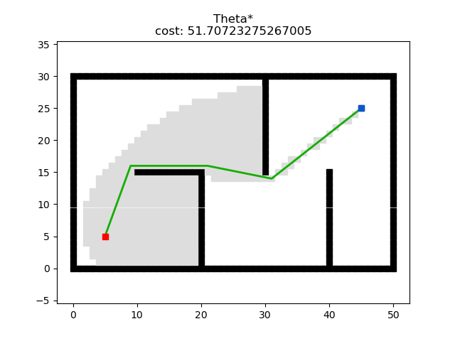
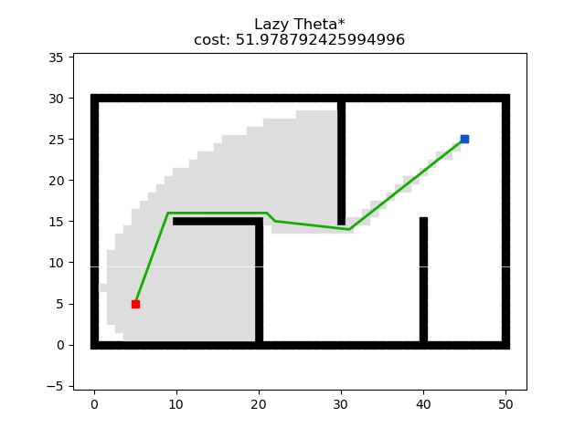
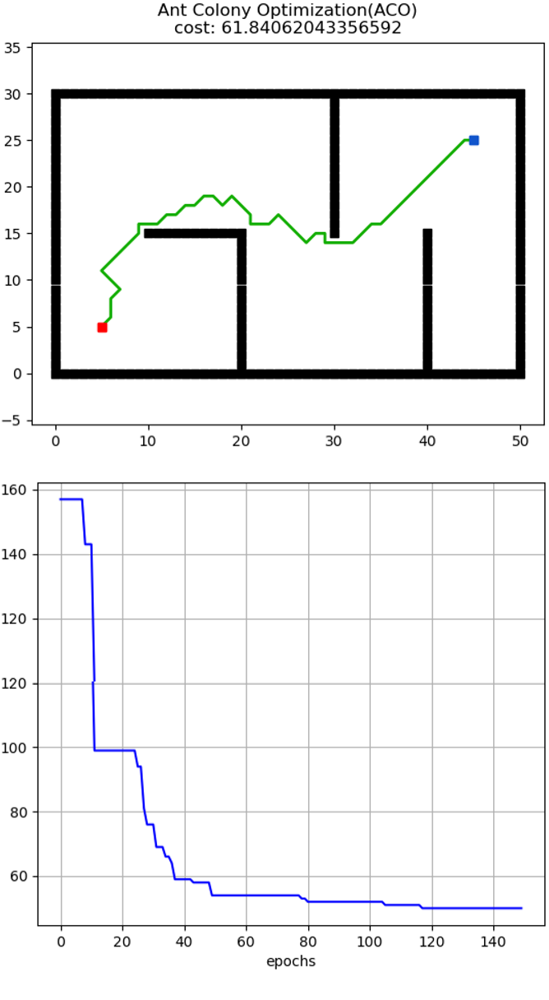
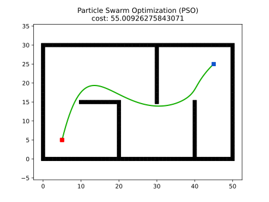
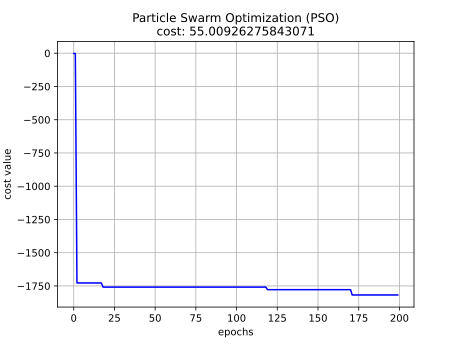
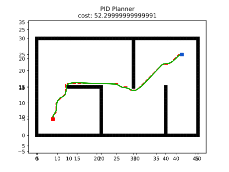
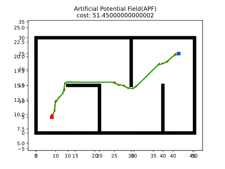
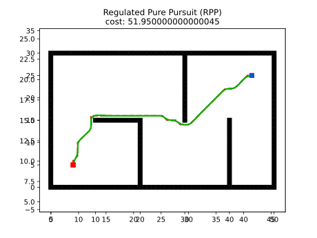
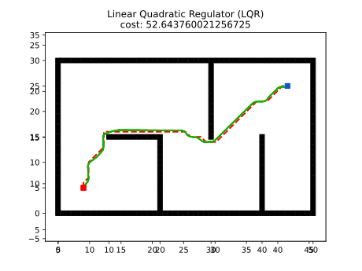
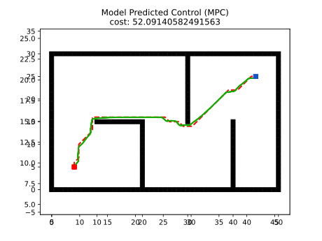

# Introduction

`Motion planning` plans the state sequence of the robot without conflict between the start and goal. 

`Motion planning` mainly includes `Path planning` and `Trajectory planning`.

* `Path Planning`: It's based on path constraints (such as obstacles), planning the optimal path sequence for the robot to travel without conflict between the start and goal.
* `Trajectory planning`: It plans the motion state to approach the global path based on kinematics, dynamics constraints and path sequence.

This repository provides the implementations of common `Motion planning` algorithms. **Your stars and forks are welcome**. Maintaining this repository requires a huge amount of work. **Therefore, you are also welcome to contribute to this repository by opening issues, submitting pull requests or joining our development team**.

The theory analysis can be found at [motion-planning](https://blog.csdn.net/frigidwinter/category_11410243.html).

We also provide [ROS C++](https://github.com/ai-winter/ros_motion_planning) version and [Matlab](https://github.com/ai-winter/matlab_motion_planning) version.

# Quick Start

## Overview
The source file structure is shown below

```
python_motion_planning
├─global_planner
|   ├─graph_search
|   ├─sample_search
|   └─evolutionary_search
├─local_planner
├─curve_generation
└─utils
    ├─agent
    ├─environment
    ├─helper
    ├─planner
    └─plot
```

* The global planning algorithm implementation is in the folder `global_planner` with `graph_search`, `sample_search` and `evolutionary search`.

* The local planning algorithm implementation is in the folder `local_planner`.

* The curve generation algorithm implementation is in the folder `curve_generation`.

## Install
*(Optional)* The code was tested in python=3.10. We recommend using `conda` to install the dependencies.

```shell
conda create -n pmp python=3.10
conda activate pmp
```

To install the repository, please run the following command in shell.

```shell
pip install python-motion-planning
```

## Run
Below are some simple examples.

1. Run A* with discrete environment (Grid)
```python
import python_motion_planning as pmp

# Create environment with custom obstacles
env = pmp.Grid(51, 31)
obstacles = env.obstacles
for i in range(10, 21):
    obstacles.add((i, 15))
for i in range(15):
    obstacles.add((20, i))
for i in range(15, 30):
    obstacles.add((30, i))
for i in range(16):
    obstacles.add((40, i))
env.update(obstacles)

planner = pmp.AStar(start=(5, 5), goal=(45, 25), env=env)   # create planner
cost, path, expand = planner.plan()                         # plan
planner.plot.animation(path, str(planner), cost, expand)    # animation
```

2. Run RRT with continuous environment (Map)
```python
import python_motion_planning as pmp

# Create environment with custom obstacles
env = pmp.Map(51, 31)
obs_rect = [
    [14, 12, 8, 2],
    [18, 22, 8, 3],
    [26, 7, 2, 12],
    [32, 14, 10, 2]
]
obs_circ = [
    [7, 12, 3],
    [46, 20, 2],
    [15, 5, 2],
    [37, 7, 3],
    [37, 23, 3]
]
env.update(obs_rect=obs_rect, obs_circ=obs_circ)

planner = pmp.RRT(start=(18, 8), goal=(37, 18), env=env)    # create planner
cost, path, expand = planner.plan()                         # plan
planner.plot.animation(path, str(planner), cost, expand)    # animation
```

More examples can be found in the folder `examples` in the repository.

For more details, you can refer to [online documentation](https://ai-winter.github.io/python_motion_planning/).

# Version
## Global Planner

Planner      | Version                                                                                                                                                                         | Animation
------------ |---------------------------------------------------------------------------------------------------------------------------------------------------------------------------------| --------- 
**GBFS**              | [](https://github.com/ai-winter/python_motion_planning/blob/master/global_planner/graph_search/gbfs.py)            |  
**Dijkstra**                 | [](https://github.com/ai-winter/python_motion_planning/blob/master/global_planner/graph_search/dijkstra.py)        | 
**A***               | [](https://github.com/ai-winter/python_motion_planning/blob/master/global_planner/graph_search/a_star.py)          |   
**JPS**                 | [](https://github.com/ai-winter/python_motion_planning/blob/master/global_planner/graph_search/jps.py)             | 
**D***                  | [](https://github.com/ai-winter/python_motion_planning/blob/master/global_planner/graph_search/d_star.py)          | 
**LPA***                 | [](https://github.com/ai-winter/python_motion_planning/blob/master/global_planner/graph_search/lpa_star.py)        |  
**D\* Lite**                | [](https://github.com/ai-winter/python_motion_planning/blob/master/global_planner/graph_search/d_star_lite.py)     | 
**Theta\***                | [](https://github.com/ai-winter/python_motion_planning/blob/master/global_planner/graph_search/theta_star.py)      | 
**Lazy Theta\***                | [](https://github.com/ai-winter/python_motion_planning/blob/master/global_planner/graph_search/lazy_theta_star.py) | 
**S-Theta\***                | [](https://github.com/ai-winter/python_motion_planning/blob/master/global_planner/graph_search/s_theta_star.py)    | 
**Anya**                | [](https://github.com/ai-winter/python_motion_planning/blob/master/global_planner/graph_search/anya.py)                 | 
**Voronoi**                | [](https://github.com/ai-winter/python_motion_planning/blob/master/global_planner/graph_search/voronoi.py)         |  
**RRT**                 | [](https://github.com/ai-winter/python_motion_planning/blob/master/global_planner/sample_search/rrt.py)            | 
**RRT***                 | [](https://github.com/ai-winter/python_motion_planning/blob/master/global_planner/sample_search/rrt_star.py)       | 
**Informed RRT**                 | [](https://github.com/ai-winter/python_motion_planning/blob/master/global_planner/sample_search/informed_rrt.py)   | 
**RRT-Connect**                | [](https://github.com/ai-winter/python_motion_planning/blob/master/global_planner/sample_search/rrt_connect.py)    | 
| **ACO** | [](https://github.com/ai-winter/python_motion_planning/blob/master/global_planner/evolutionary_search/aco.py)      | 
| **GA**  |                                                                                                                         |  
| **PSO**  | [](https://github.com/ai-winter/python_motion_planning/blob/master/global_planner/evolutionary_search/pso.py)      |   


## Local Planner

| Planner     | Version                                                                                                                                                | Animation                                     
|-------------|--------------------------------------------------------------------------------------------------------------------------------------------------------| -------------------------------------------------- 
| **PID**     | [](https://github.com/ai-winter/python_motion_planning/blob/master/local_planner/pid.py)  |  
| **APF**     | [](https://github.com/ai-winter/python_motion_planning/blob/master/local_planner/apf.py)  |  
| **DWA**     | [](https://github.com/ai-winter/python_motion_planning/blob/master/local_planner/dwa.py)  | 
| **RPP**     | [](https://github.com/ai-winter/python_motion_planning/blob/master/local_planner/rpp.py)  | 
| **LQR**     | [](https://github.com/ai-winter/python_motion_planning/blob/master/local_planner/lqr.py)  |  
| **TEB**     |                                                                                                |  
| **MPC**     | [](https://github.com/ai-winter/python_motion_planning/blob/master/local_planner/mpc.py)  | 
| **MPPI**    |                                                                                                |
| **Lattice** |                                                                                                |
| **DQN**    |                                                                                                |
| **DDPG**    |                                                                                                |

## Curve Generation

| Planner | Version   | Animation                                |
| ------- | -------------------------------------------------------- | -------------------------------------------------------- 
| **Polynomia** | [](https://github.com/ai-winter/python_motion_planning/blob/master/curve_generation/polynomial_curve.py) | 
| **Bezier** | [](https://github.com/ai-winter/python_motion_planning/blob/master/curve_generation/bezier_curve.py) | 
| **Cubic Spline** | [](https://github.com/ai-winter/python_motion_planning/blob/master/curve_generation/cubic_spline.py) | 
| **BSpline** | [](https://github.com/ai-winter/python_motion_planning/blob/master/curve_generation/bspline_curve.py) | 
| **Dubins** | [](https://github.com/ai-winter/python_motion_planning/blob/master/curve_generation/dubins_curve.py) | 
| **Reeds-Shepp** | [](https://github.com/ai-winter/python_motion_planning/blob/master/curve_generation/reeds_shepp.py) | 
| **Fem-Pos Smoother** | [](https://github.com/ai-winter/python_motion_planning/blob/master/curve_generation/fem_pos_smooth.py) | 


# Papers
## Global Planning

* [A*: ](https://ieeexplore.ieee.org/document/4082128) A Formal Basis for the heuristic Determination of Minimum Cost Paths
* [JPS:](https://ojs.aaai.org/index.php/AAAI/article/view/7994) Online Graph Pruning for Pathfinding On Grid Maps
* [Lifelong Planning A*: ](https://www.cs.cmu.edu/~maxim/files/aij04.pdf) Lifelong Planning A*
* [D*: ](http://web.mit.edu/16.412j/www/html/papers/original_dstar_icra94.pdf) Optimal and Efficient Path Planning for Partially-Known Environments
* [D* Lite: ](http://idm-lab.org/bib/abstracts/papers/aaai02b.pdf) D* Lite
* [Theta*: ](https://www.jair.org/index.php/jair/article/view/10676) Theta*: Any-Angle Path Planning on Grids
* [Lazy Theta*: ](https://ojs.aaai.org/index.php/AAAI/article/view/7566) Lazy Theta*: Any-Angle Path Planning and Path Length Analysis in 3D
* [S-Theta*: ](https://link.springer.com/chapter/10.1007/978-1-4471-4739-8_8) S-Theta*: low steering path-planning algorithm
* [Anya: ](http://www.grastien.net/ban/articles/hgoa-jair16.pdf) Optimal Any-Angle Pathfinding In Practice
* [RRT: ](http://msl.cs.uiuc.edu/~lavalle/papers/Lav98c.pdf) Rapidly-Exploring Random Trees: A New Tool for Path Planning
* [RRT-Connect: ](http://www-cgi.cs.cmu.edu/afs/cs/academic/class/15494-s12/readings/kuffner_icra2000.pdf) RRT-Connect: An Efficient Approach to Single-Query Path Planning
* [RRT*: ](https://journals.sagepub.com/doi/abs/10.1177/0278364911406761) Sampling-based algorithms for optimal motion planning
* [Informed RRT*: ](https://arxiv.org/abs/1404.2334) Optimal Sampling-based Path Planning Focused via Direct Sampling of an Admissible Ellipsoidal heuristic
* [ACO: ](http://www.cs.yale.edu/homes/lans/readings/routing/dorigo-ants-1999.pdf) Ant Colony Optimization: A New Meta-Heuristic

## Local Planning

* [DWA: ](https://www.ri.cmu.edu/pub_files/pub1/fox_dieter_1997_1/fox_dieter_1997_1.pdf) The Dynamic Window Approach to Collision Avoidance
* [APF: ](https://ieeexplore.ieee.org/document/1087247) Real-time obstacle avoidance for manipulators and mobile robots
* [RPP: ](https://arxiv.org/pdf/2305.20026.pdf) Regulated Pure Pursuit for Robot Path Tracking
* [DDPG: ](https://arxiv.org/abs/1509.02971) Continuous control with deep reinforcement learning

## Curve Generation

* [Dubins: ]() On curves of minimal length with a constraint on average curvature, and with prescribed initial and terminal positions and tangents

# Acknowledgment

* Our visualization and animation framework of Python Version refers to [https://github.com/zhm-real/PathPlanning](https://github.com/zhm-real/PathPlanning). Thanks sincerely.
