# Introduction

`Motion planning` plans the state sequence of the robot without conflict between the start and goal. 

`Motion planning` mainly includes `Path planning` and `Trajectory planning`.

* `Path Planning`: It's based on path constraints (such as obstacles), planning the optimal path sequence for the robot to travel without conflict between the start and goal.
* `Trajectory planning`: It plans the motion state to approach the global path based on kinematics, dynamics constraints and path sequence.

This repository provides the implementations of common `Motion planning` algorithms, including path planners on N-D grid and controllers for path-tracking, a visualizer based on matplotlib and a toy physical simulator to test controllers.

The theory analysis can be found at [motion-planning](https://blog.csdn.net/frigidwinter/category_11410243.html).

We also provide [ROS C++](https://github.com/ai-winter/ros_motion_planning) version and [Matlab](https://github.com/ai-winter/matlab_motion_planning) version.

**Your stars and forks are welcome!**

# Quick Start

## Overview
The source file structure is shown below

```
python_motion_planning
├─common
|   ├─env
|   |   ├─map
|   |   ├─robot
|   |   └─world
|   ├─utils
|   └─visualizer
├─controller
|   └─path_tracker
├─path_planner
|   ├─graph_search
|   └─sample_search
└─curve_generation
```

## Install
*(Optional)* The code was tested in python=3.10, though other similar versions should also work. We recommend using `conda` to install the dependencies.

```shell
conda create -n pmp python=3.10
conda activate pmp
```

To install the repository, please run the following command in shell.

```shell
pip install python-motion-planning==2.0.dev1
```

## Run

Please refer to the Tutorials part of [online documentation](https://ai-winter.github.io/python_motion_planning/).

# Demos
## Path Planner
### Graph Search
|Planner|2D Grid|3D Grid
|-------|-------|-------
**Dijkstra**|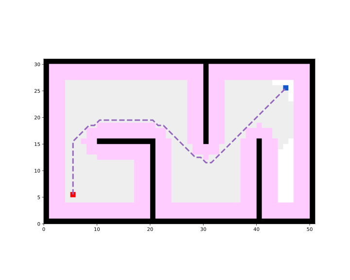|
**GBFS**||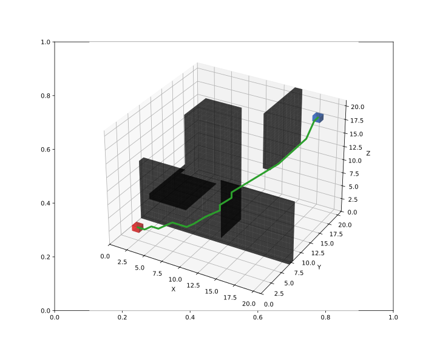
**A\***||
**JPS**|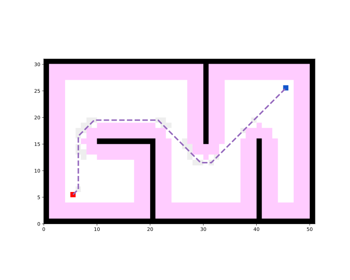|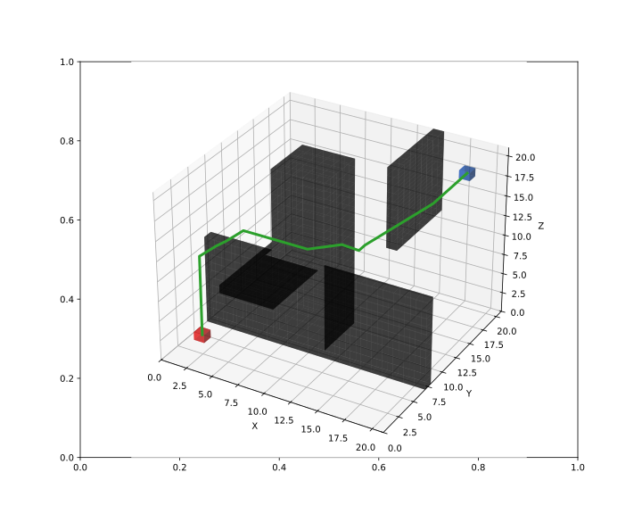
**Theta\***|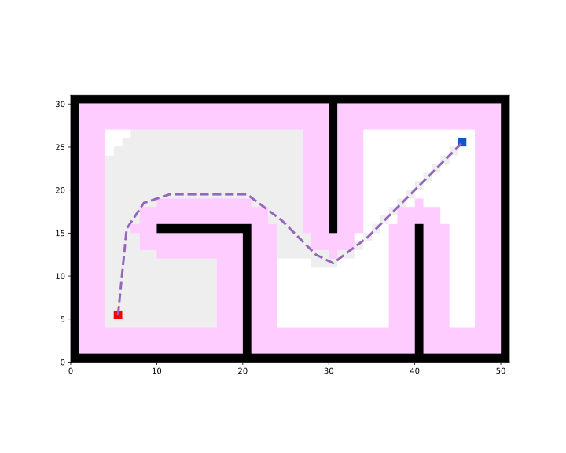|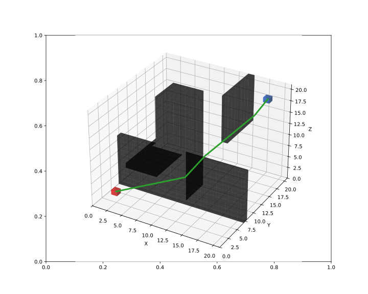
**Lazy Theta\***||
**Voronoi**|Implemented in [V1.1.1](https://github.com/ai-winter/python_motion_planning/tree/v1.1.1), not migrated|Not implemented
**D\***|Implemented in [V1.1.1](https://github.com/ai-winter/python_motion_planning/tree/v1.1.1), not migrated|Not implemented
**LPA\***|Implemented in [V1.1.1](https://github.com/ai-winter/python_motion_planning/tree/v1.1.1), not migrated|Not implemented
**D\* Lite**|Implemented in [V1.1.1](https://github.com/ai-winter/python_motion_planning/tree/v1.1.1), not migrated|Not implemented
**Anya**|Not implemented|Not implemented

### Sample Search
|Planner|2D Grid|3D Grid
|-------|-------|-------
**RRT**|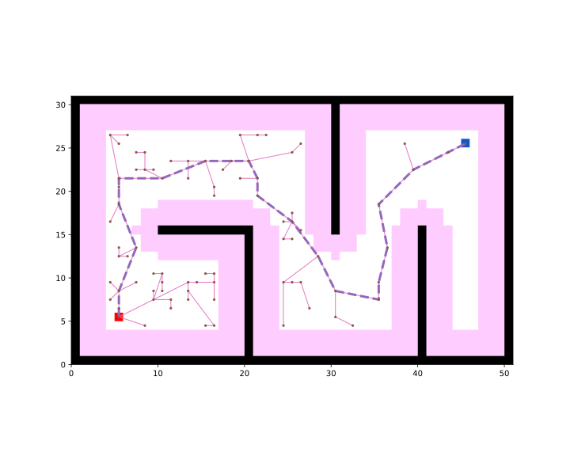|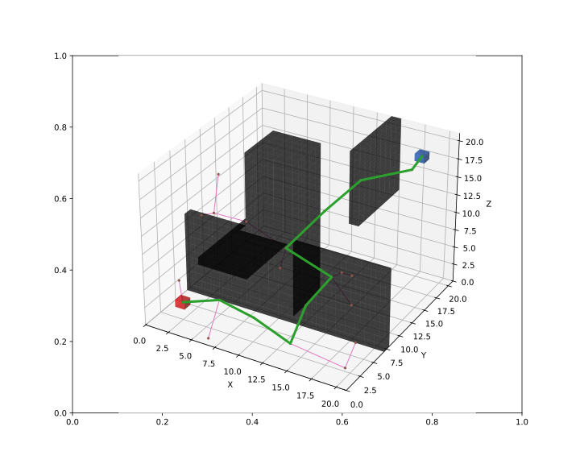
**RRT\***|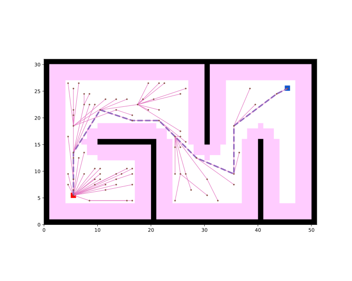|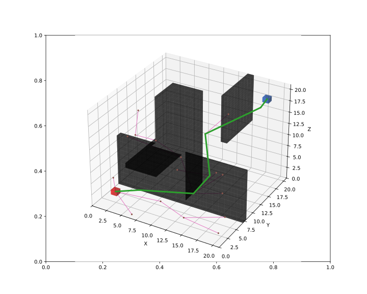
**RRT-Connect**|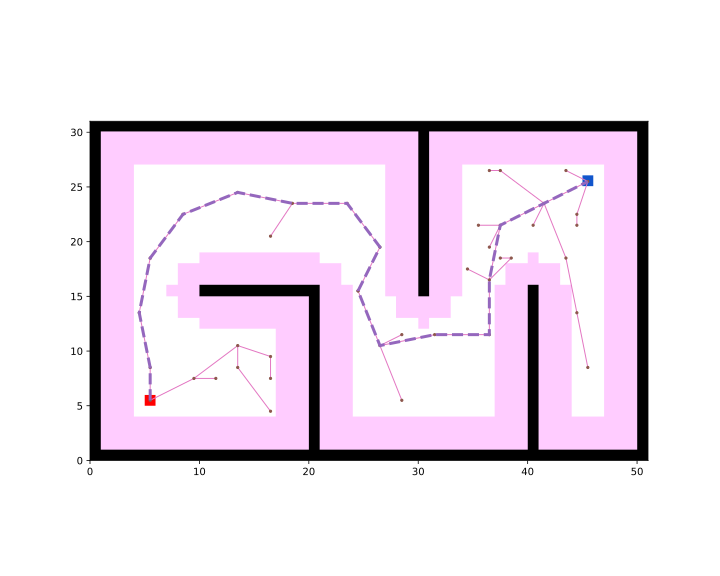|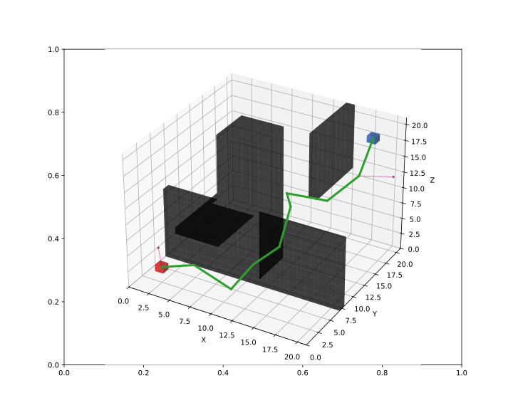
**Informed RRT**|Implemented in [V1.1.1](https://github.com/ai-winter/python_motion_planning/tree/v1.1.1), not migrated|Not implemented
**PRM**|Not implemented|Not implemented

### Evolutionary Search
|Planner|2D Grid|3D Grid
|-------|-------|-------
| **ACO** |Implemented in [V1.1.1](https://github.com/ai-winter/python_motion_planning/tree/v1.1.1), not migrated|Not implemented
| **GA**  |Implemented in [V1.1.1](https://github.com/ai-winter/python_motion_planning/tree/v1.1.1), not migrated|Not implemented
| **PSO**  |Implemented in [V1.1.1](https://github.com/ai-winter/python_motion_planning/tree/v1.1.1), not migrated|Not implemented


## Controller

We provide a toy simulator with simple physical simulation to test controllers (path-trakcers). The toy simulator supports multi-agents/multi-robots. The available robots include `CircularRobot` (Omnidirectional) and `DiffDriveRobot` (Only support moving forward and backward). Currently only 2D simulator is provided. 3D simulator has not been implemented.

In the following demos, the blue robot 1 is the `CircularRobot`, and the orange robot 2 is the `DiffDriveRobot`.

|Controller|2D|3D
|-------|-------|-------
|**Path Trakcer**||Not implemented
| **Pure Pursuit**     ||Not implemented
| **PID**     ||Not implemented
| **APF**     ||Not implemented
| **DWA**     ||Not implemented
| **RPP**     |Implemented in [V1.1.1](https://github.com/ai-winter/python_motion_planning/tree/v1.1.1), not migrated|Not implemented
| **LQR**     |Implemented in [V1.1.1](https://github.com/ai-winter/python_motion_planning/tree/v1.1.1), not migrated|Not implemented
| **MPC**     |Implemented in [V1.1.1](https://github.com/ai-winter/python_motion_planning/tree/v1.1.1), not migrated|Not implemented
| **MPPI**    |Not implemented|Not implemented
| **TEB**     |Not implemented|Not implemented
| **Lattice** |Not implemented|Not implemented
| **DQN**    |Not implemented|Not implemented
| **DDPG**    |Implemented in [V1.0](https://github.com/ai-winter/python_motion_planning/tree/v1.0), not migrated|Not implemented

## Curve Generator

The visualization of the curve generators has not been implemented in current version. They can be visualized in [V1.1.1](https://github.com/ai-winter/python_motion_planning/tree/v1.1.1).

|Generator|2D|3D|
| ------- | -------------------------------------------------------- | -------------------------------------------------------- 
| **Polynomia** | |Not implemented
| **Bezier** ||Not implemented
| **Cubic Spline** ||Not implemented
| **BSpline** ||Not implemented
| **Dubins** ||Not implemented
| **Reeds-Shepp** ||Not implemented
| **Fem-Pos Smoother** ||Not implemented

# Future Works

* N-D controllers (path-trackers).

* Path planning in configuration space for arm robots.

* Path planning on topological map.

* Provide ROS and ROS2 wrapper.

* Application in mainstream robot simulation environments (e.g. Gazebo, Carla, Airsim, PyBullet, MuJoCo, Issac Sim).

* More mainstream motion planning algorithms.

* Performance optimization.

Contributors are welcome! For trivial modification, please directly contribute to `dev` branch. For big modification, please [contact](#contact) us before you contribute.

# Contact

Long-term maintainers:

* [@omigeft](https://github.com/omigeft) (Wu Maojia)
* [@ai-winter](https://github.com/ai-winter) (Yang Haodong)

You can contact us via the information provided on our profile.
