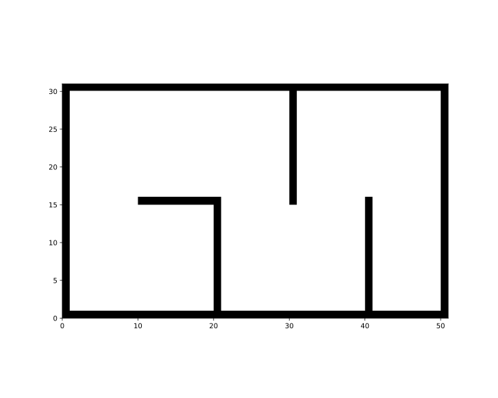
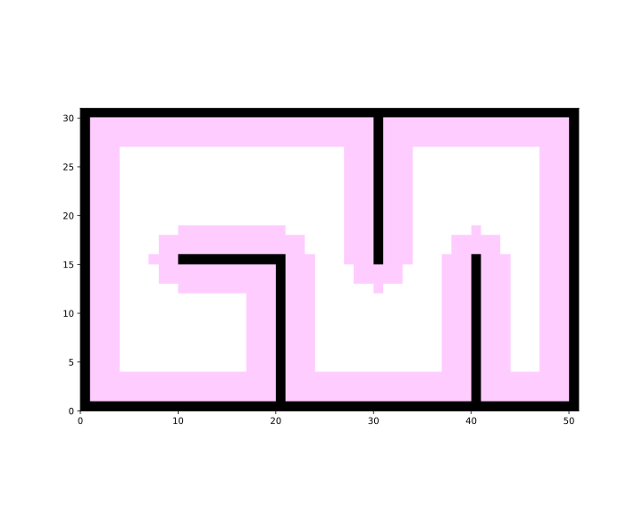
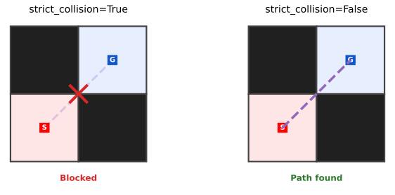
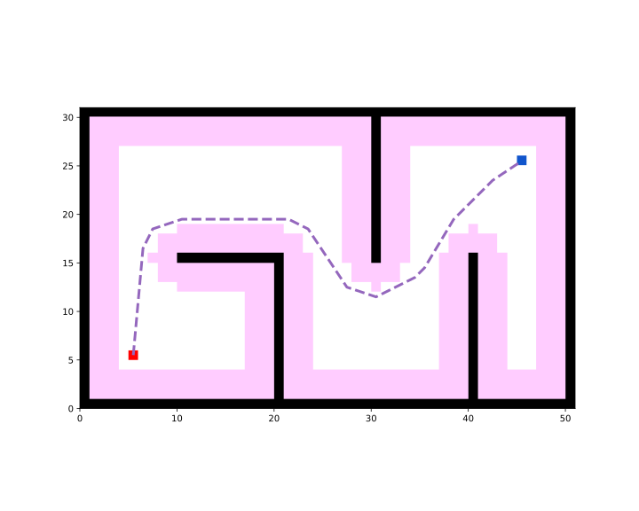
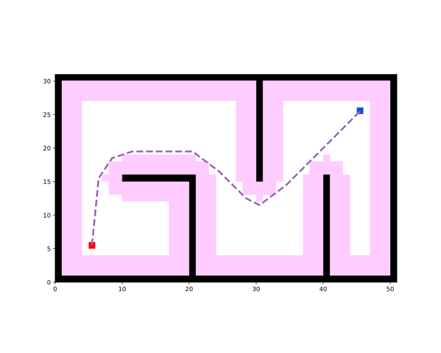

Fix the random seed to ensure reproducible results.

```python
import random
random.seed(0)

import numpy as np
np.random.seed(0)
```

Import necessary modules.

```python
from python_motion_planning.common import *
from python_motion_planning.path_planner import *
from python_motion_planning.controller import *
```

Define the grid map and add obstacles.

Grid map is the most commonly used map format in the field of path planning. The world frame is a global coordinate system representing the robot and environment in the real world, while the grid map frame is a local or discrete coordinate system used for grid-based maps, typically tied to map resolution and cell indices.

The bounds argument defines the range of the grid map in world frame. Then the size of the discrete grid map is then automatically calculated with the resolution argument. The default resolution of the Grid class is 1, so the calculated discrete size of the grid map is 51\*31.

After creating the grid map, we add some obstacles to it for testing the path planners.

```python
map_ = Grid(bounds=[[0, 51], [0, 31]])
map_.fill_boundary_with_obstacles()
map_[10:21, 15] = TYPES.OBSTACLE
map_[20, :15] = TYPES.OBSTACLE
map_[30, 15:] = TYPES.OBSTACLE
map_[40, :16] = TYPES.OBSTACLE
```

Visualize to check the map.

```python
vis = Visualizer2D()
vis.plot_grid_map(map_)
vis.show()
```



Inflate the obstacles to prevent path planners from planning paths too close to the obstacles. The inflation radius here is set to 3 cells, and the argument is adjustable.

```python
map_.inflate_obstacles(radius=3)
```

Visualize to check the map.

```python
vis = Visualizer2D()
vis.plot_grid_map(map_)
vis.show()
vis.close()
```



Runnable complete code:

```python
import random
random.seed(0)

import numpy as np
np.random.seed(0)

from python_motion_planning.common import *
from python_motion_planning.path_planner import *
from python_motion_planning.controller import *

map_ = Grid(bounds=[[0, 51], [0, 31]])

map_.fill_boundary_with_obstacles()
map_[10:21, 15] = TYPES.OBSTACLE
map_[20, :15] = TYPES.OBSTACLE
map_[30, 15:] = TYPES.OBSTACLE
map_[40, :16] = TYPES.OBSTACLE

map_.inflate_obstacles(radius=3)

vis = Visualizer2D()
vis.plot_grid_map(map_)
vis.show()
vis.close()
```

The `strict_collision` argument controls whether diagonal motion is allowed beside obstacles or inflation cells. It is `True` by default. In strict mode, a diagonal step is considered a collision if either of the two side cells at the crossed corner is blocked. This prevents a path from passing through a diagonal gap. When it is `False`, only the cells on the discretized line are checked, so corner cutting is allowed. The mode can also be changed after the map is created through `map_.strict_collision`.



The effect can also be seen by running Theta\* on the tutorial map. Recreate the map and enable strict collision checking first. The code tutorial on path planning can be found in later chapters.

```python
map_ = Grid(bounds=[[0, 51], [0, 31]], strict_collision=True)
map_.fill_boundary_with_obstacles()
map_[10:21, 15] = TYPES.OBSTACLE
map_[20, :15] = TYPES.OBSTACLE
map_[30, 15:] = TYPES.OBSTACLE
map_[40, :16] = TYPES.OBSTACLE
map_.inflate_obstacles(radius=3)

start = (5, 5)
goal = (45, 25)
map_[start] = TYPES.START
map_[goal] = TYPES.GOAL

planner = ThetaStar(map_=map_, start=start, goal=goal)
path, path_info = planner.plan()

strict_vis = Visualizer2D()
strict_vis.plot_grid_map(map_)
strict_vis.plot_path(path, style="--", color="C4")
strict_vis.show()
strict_vis.close()
```



Disable strict collision checking and plan again on the same map to allow corner cutting.

```python
map_.strict_collision = False
planner = ThetaStar(map_=map_, start=start, goal=goal)
path, path_info = planner.plan()

relaxed_vis = Visualizer2D()
relaxed_vis.plot_grid_map(map_)
relaxed_vis.plot_path(path, style="--", color="C4")
relaxed_vis.show()
relaxed_vis.close()
```


