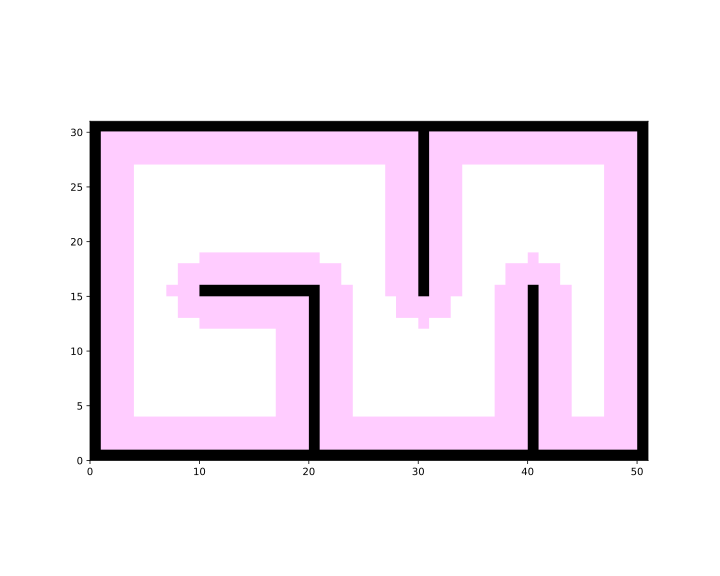

Fix the random seed to ensure reproducible results.

```python
import random
random.seed(0)

import numpy as np
np.random.seed(0)
```

Import necessary modules.

```python
from python_motion_planning.common import *
from python_motion_planning.path_planner import *
from python_motion_planning.controller import *
```

Define the grid map and add obstacles.

```python
map_ = Grid(bounds=[[0, 51], [0, 31]])
map_.fill_boundary_with_obstacles()
map_.type_map[10:21, 15] = TYPES.OBSTACLE
map_.type_map[20, :15] = TYPES.OBSTACLE
map_.type_map[30, 15:] = TYPES.OBSTACLE
map_.type_map[40, :16] = TYPES.OBSTACLE
```

Visualize to check the map.

```python
vis = Visualizer("Path Visualizer")
vis.plot_grid_map(map_)
vis.show()
```


Inflate the obstacles to prevent path planners from planning paths too close to the obstacles.

```python
map_.inflate_obstacles(radius=3)
```

Visualize to check the map.

```python
vis = Visualizer("Path Visualizer")
vis.plot_grid_map(map_)
vis.show()
vis.close()
```



Runnable complete code:

```python
import random
random.seed(0)

import numpy as np
np.random.seed(0)

from python_motion_planning.common import *
from python_motion_planning.path_planner import *
from python_motion_planning.controller import *

map_ = Grid(bounds=[[0, 51], [0, 31]])

map_.fill_boundary_with_obstacles()
map_.type_map[10:21, 15] = TYPES.OBSTACLE
map_.type_map[20, :15] = TYPES.OBSTACLE
map_.type_map[30, 15:] = TYPES.OBSTACLE
map_.type_map[40, :16] = TYPES.OBSTACLE

map_.inflate_obstacles(radius=3)

vis = Visualizer("Path Visualizer")
vis.plot_grid_map(map_)
vis.show()
vis.close()
```