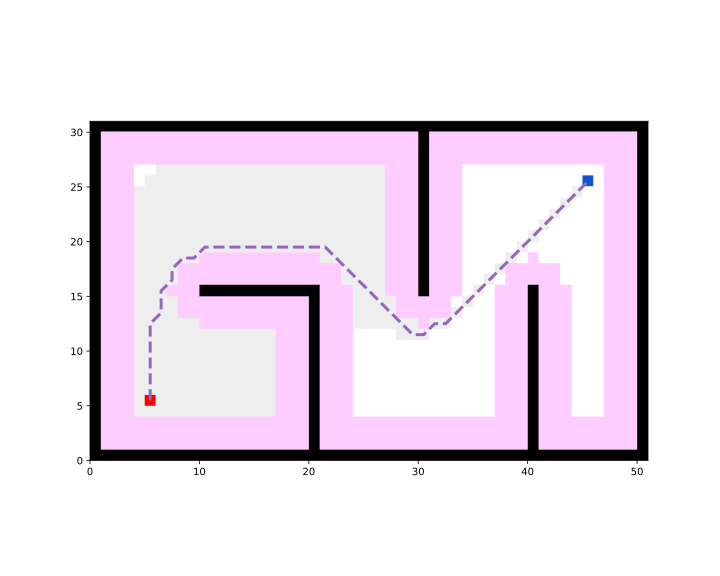

Define start and goal points.

```python
start = (5, 5)
goal = (45, 25)
```

Add the start and goal points to the map.
```python
map_.type_map[start] = TYPES.START
map_.type_map[goal] = TYPES.GOAL
```

Create the path-planner and plan the path.
```python
planner = AStar(map_=map_, start=start, goal=goal)
path, path_info = planner.plan()
print(path)
print(path_info)
map_.fill_expands(path_info["expand"])  # for visualizing the expanded nodes
```

Print results:
```
[(5, 5), (5, 6), (5, 7), (5, 8), (5, 9), (5, 10), (5, 11), (5, 12), (6, 13), (6, 14), (6, 15), (7, 16), (7, 17), (8, 18), (9, 18), (10, 19), (11, 19), (12, 19), (13, 19), (14, 19), (15, 19), (16, 19), (17, 19), (18, 19), (19, 19), (20, 19), (21, 19), (22, 18), (23, 17), (24, 16), (25, 15), (26, 14), (27, 13), (28, 12), (29, 11), (30, 11), (31, 12), (32, 12), (33, 13), (34, 14), (35, 15), (36, 16), (37, 17), (38, 18), (39, 19), (40, 20), (41, 21), (42, 22), (43, 23), (44, 24), (45, 25)]
{'success': True, 'start': (5, 5), 'goal': (45, 25), 'length': 60.76955262170047, 'cost': 60.76955262170047, 'expand': {(5, 5): Node((5, 5), None, 0, 44.721359549995796), ...}}
```

Visualize.
```python
vis = Visualizer("Path Visualizer")
vis.plot_grid_map(map_)
vis.plot_path(path, style="--", color="C4")
vis.show()
vis.close()
```



Runnable complete code:

```python
import random
random.seed(0)

import numpy as np
np.random.seed(0)

from python_motion_planning.common import *
from python_motion_planning.path_planner import *
from python_motion_planning.controller import *

map_ = Grid(bounds=[[0, 51], [0, 31]])

map_.fill_boundary_with_obstacles()
map_.type_map[10:21, 15] = TYPES.OBSTACLE
map_.type_map[20, :15] = TYPES.OBSTACLE
map_.type_map[30, 15:] = TYPES.OBSTACLE
map_.type_map[40, :16] = TYPES.OBSTACLE

map_.inflate_obstacles(radius=3)

start = (5, 5)
goal = (45, 25)

map_.type_map[start] = TYPES.START
map_.type_map[goal] = TYPES.GOAL

planner = AStar(map_=map_, start=start, goal=goal)
path, path_info = planner.plan()
print(path)
print(path_info)
map_.fill_expands(path_info["expand"])  # for visualizing the expanded nodes

vis = Visualizer("Path Visualizer")
vis.plot_grid_map(map_)
vis.plot_path(path, style="--", color="C4")
vis.show()
vis.close()
```