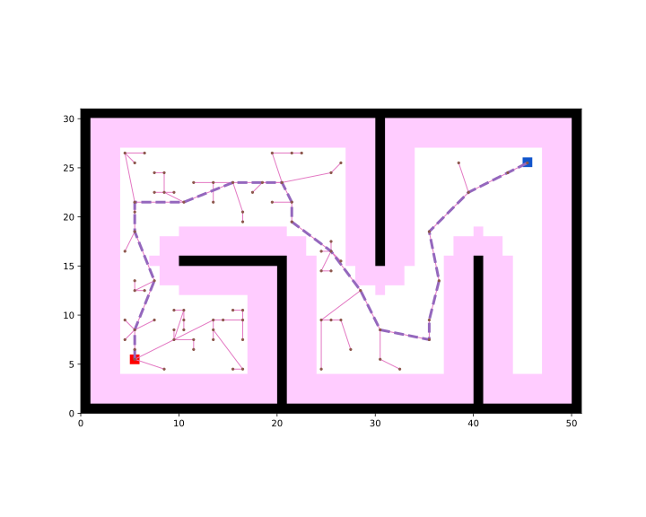

Create the path-planner and plan the path.
```python
planner = RRT(map_=map_, start=start, goal=goal)
path, path_info = planner.plan()
print(path)
print(path_info)
```

Print results:
```
[(5, 5), (5, 8), (7, 13), (5, 18), (5, 21), (10, 21), (15, 23), (20, 23), (21, 21), (21, 19), (25, 16), (28, 12), (30, 8), (35, 7), (35, 9), (36, 13), (35, 18), (39, 22), (43, 24), (45, 25)]
{'success': True, 'start': (5, 5), 'goal': (45, 25), 'length': 79.54990118869786, 'cost': 79.54990118869786, 'expand': {(5, 5): Node((5, 5), None, 0, 0), ...}}
```

Visualize.
```python
vis = Visualizer("Path Visualizer")
vis.plot_grid_map(map_)
vis.plot_path(path, style="--", color="C4")
vis.plot_expand_tree(path_info["expand"])   # sample-search-featured expand tree
vis.show()
vis.close()
```



Runnable complete code:

```python
import random
random.seed(0)

import numpy as np
np.random.seed(0)

from python_motion_planning.common import *
from python_motion_planning.path_planner import *
from python_motion_planning.controller import *

map_ = Grid(bounds=[[0, 51], [0, 31]])

map_.fill_boundary_with_obstacles()
map_.type_map[10:21, 15] = TYPES.OBSTACLE
map_.type_map[20, :15] = TYPES.OBSTACLE
map_.type_map[30, 15:] = TYPES.OBSTACLE
map_.type_map[40, :16] = TYPES.OBSTACLE

map_.inflate_obstacles(radius=3)

start = (5, 5)
goal = (45, 25)

map_.type_map[start] = TYPES.START
map_.type_map[goal] = TYPES.GOAL

planner = RRT(map_=map_, start=start, goal=goal)
path, path_info = planner.plan()
print(path)
print(path_info)

vis = Visualizer("Path Visualizer")
vis.plot_grid_map(map_)
vis.plot_path(path, style="--", color="C4")
vis.plot_expand_tree(path_info["expand"])
vis.show()
vis.close()
```