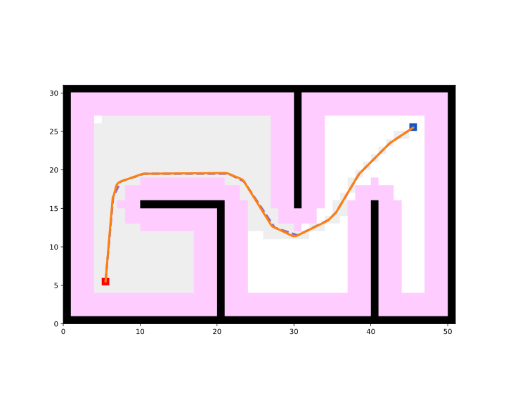

After a path planner returns a sequence of waypoints, the path is usually piecewise linear and not directly executable by a real robot. A trajectory optimizer smooths or reshapes the waypoints into a geometrically continuous curve that is easier to follow for the path tracking controllers. In this library, the curve generators take waypoints in world frame and return a smoothed path in world frame, together with a dictionary containing the curve information (success, length).

The curve generators are grouped into two categories by the format of the input waypoints:

- **Point-based** generators (e.g. `BSpline`, `CubicSpline`) take 2D positions $(x, y)$ only. They are commonly used to smooth the output of grid-based path planners like Theta\* where the waypoints have no orientation.
- **Pose-based** generators (e.g. `ReedsShepp`, `Dubins`, `Bezier`, `Polynomial`) take 2D poses $(x, y, \theta)$ with orientation. They are commonly used to connect key poses for car-like robots with curvature constraints.

Import the trajectory optimizer module along with the other modules.

```python
from python_motion_planning.common import *
from python_motion_planning.path_planner import *
from python_motion_planning.controller import *
from python_motion_planning.traj_optimizer import *
```

## Point-based curve generator (B-Spline)

For point-based generators, we first plan a path with any global path planner and then transform the waypoints from map frame to world frame, just like we do before passing a path to a controller.

```python
planner = ThetaStar(map_=map_, start=start, goal=goal)
path, path_info = planner.plan()
map_.fill_expands(path_info["expand"])  # for visualizing the expanded nodes

path_world = map_.path_map_to_world(path)
```

Create the curve generator and generate a smoothed curve. Here the B-Spline curve is taken as an example. You can set the `step` argument to control the sampling density along the curve and the `k` argument to control the degree of the B-Spline. The `param_mode` and `spline_mode` arguments control the parameter selection and the B-Spline construction mode respectively. Please refer to the API Reference part for more details.

```python
generator = BSpline(step=0.01, k=3, param_mode="centripetal", spline_mode="interpolation")
smooth_path, curve_info = generator.generate(path_world)
print(curve_info)
```

Print results:

```
{'success': True, 'length': 59.68077764623435}
```

Visualize. The original Theta\* path is drawn with a dashed line for comparison, and the smoothed B-Spline curve is drawn with a solid line. Note that `map_frame` is set to `False` because the curve generator returns waypoints in world frame.

```python
vis = Visualizer2D()
vis.plot_grid_map(map_)
vis.plot_path(path, style="--", color="C4")
vis.plot_path(smooth_path, style="-", color="C1", map_frame=False)
vis.show()
vis.close()
```


Runnable complete code:

```python
import random
random.seed(0)

import numpy as np
np.random.seed(0)

from python_motion_planning.common import *
from python_motion_planning.path_planner import *
from python_motion_planning.controller import *
from python_motion_planning.traj_optimizer import *

map_ = Grid(bounds=[[0, 51], [0, 31]])

map_.fill_boundary_with_obstacles()
map_.type_map[10:21, 15] = TYPES.OBSTACLE
map_.type_map[20, :15] = TYPES.OBSTACLE
map_.type_map[30, 15:] = TYPES.OBSTACLE
map_.type_map[40, :16] = TYPES.OBSTACLE

map_.inflate_obstacles(radius=3)

start = (5, 5)
goal = (45, 25)

map_.type_map[start] = TYPES.START
map_.type_map[goal] = TYPES.GOAL

planner = ThetaStar(map_=map_, start=start, goal=goal)
path, path_info = planner.plan()
map_.fill_expands(path_info["expand"])

path_world = map_.path_map_to_world(path)

generator = BSpline(step=0.01, k=3, param_mode="centripetal", spline_mode="interpolation")
smooth_path, curve_info = generator.generate(path_world)
print(curve_info)

vis = Visualizer2D()
vis.plot_grid_map(map_)
vis.plot_path(path, style="--", color="C4")
vis.plot_path(smooth_path, style="-", color="C1", map_frame=False)
vis.show()
vis.close()
```

## Pose-based curve generator (Reeds-Shepp)

Pose-based generators take a list of poses $(x, y, \theta)$ in world frame rather than plain 2D positions, because the shape of the curve depends on the orientation at each waypoint. This fits scenarios where key poses are given by the user or produced by a pose-aware planner.

If you only have 2D positions, you can use `Geometry.add_orient_to_2d_path` to automatically assign each waypoint an orientation pointing to the next waypoint, without manually constructing the pose list.

```python
path_with_orient = Geometry.add_orient_to_2d_path(path_world)
print(path_with_orient[:3])
```

Print results:

```
[(5.5, 5.5, 1.4711276743037347), (6.5, 15.5, 0.982793723247329), (8.5, 18.5, 0.3217505543966422)]
```

Create the Reeds-Shepp curve generator and generate the curve. The `max_curv` argument sets the maximum curvature the car-like robot can execute, which is generally set as the inverse of the minimum turning radius $\frac{1}{r_\text{min}}$. The generator automatically searches over all Reeds-Shepp motion patterns (forward and backward) and picks the shortest feasible combination for each segment. Please refer to the API Reference part for more details.

```python
generator = ReedsShepp(step=0.01, max_curv=1.0)
smooth_path, curve_info = generator.generate(path_with_orient)
print(curve_info)
```

Print results:

```
{'success': True, 'length': 59.75446987444724}
```

Visualize. The original Theta\* path is drawn with a dashed line for comparison, and the generated Reeds-Shepp curve is drawn with a solid line. Again, `map_frame` is set to `False` because the curve is in world frame.

```python
vis = Visualizer2D()
vis.plot_grid_map(map_)
vis.plot_path(path, style="--", color="C4")
vis.plot_path(smooth_path, style="-", color="C1", map_frame=False)
vis.show()
vis.close()
```



Runnable complete code:

```python
import random
random.seed(0)

import numpy as np
np.random.seed(0)

from python_motion_planning.common import *
from python_motion_planning.path_planner import *
from python_motion_planning.controller import *
from python_motion_planning.traj_optimizer import *

map_ = Grid(bounds=[[0, 51], [0, 31]])

map_.fill_boundary_with_obstacles()
map_.type_map[10:21, 15] = TYPES.OBSTACLE
map_.type_map[20, :15] = TYPES.OBSTACLE
map_.type_map[30, 15:] = TYPES.OBSTACLE
map_.type_map[40, :16] = TYPES.OBSTACLE

map_.inflate_obstacles(radius=3)

start = (5, 5)
goal = (45, 25)

map_.type_map[start] = TYPES.START
map_.type_map[goal] = TYPES.GOAL

planner = ThetaStar(map_=map_, start=start, goal=goal)
path, path_info = planner.plan()
map_.fill_expands(path_info["expand"])

path_world = map_.path_map_to_world(path)
path_with_orient = Geometry.add_orient_to_2d_path(path_world)

generator = ReedsShepp(step=0.01, max_curv=1.0)
smooth_path, curve_info = generator.generate(path_with_orient)
print(curve_info)

vis = Visualizer2D()
vis.plot_grid_map(map_)
vis.plot_path(path, style="--", color="C4")
vis.plot_path(smooth_path, style="-", color="C1", map_frame=False)
vis.show()
vis.close()
```

For more curve generators and their arguments, please refer to API Reference.
