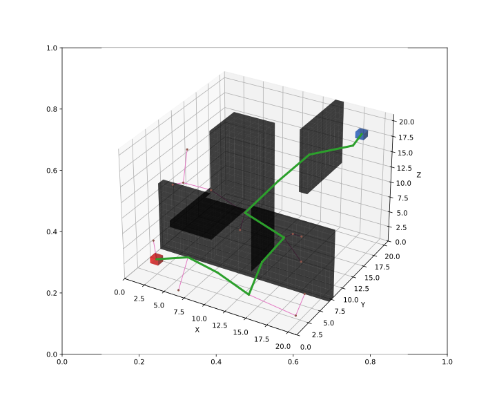

Create the path-planner and plan the path.
```python
planner = RRT(map_=map_, start=start, goal=goal)
path, path_info = planner.plan()
print(path)
print(path_info)
```

Print results:
```
[(2, 2, 2), (6, 2, 4), (9, 3, 2), (14, 1, 2), (15, 2, 7), (17, 3, 11), (13, 2, 14), (14, 7, 16), (16, 10, 19), (19, 14, 19), (18, 18, 18)]
{'success': True, 'start': (2, 2, 2), 'goal': (18, 18, 18), 'length': 47.88698780215766, 'cost': 47.88698780215766, 'expand': {(2, 2, 2): Node((2, 2, 2), None, 0, 0), ...}}
```

Visualize.
```python
vis = Visualizer("Path Visualizer")
vis.plot_grid_map(map_)
vis.plot_path(path, style="-", color="C2")
vis.plot_expand_tree(path_info["expand"])   # sample-search-featured expand tree
vis.show()
vis.close()
```



Runnable complete code:

```python
import random
random.seed(0)

import numpy as np
np.random.seed(0)

from python_motion_planning.common import *
from python_motion_planning.path_planner import *
from python_motion_planning.controller import *

map_ = Grid(bounds=[[0, 21], [0, 21], [0, 21]], resolution=1.0)
map_.type_map[:, 7, 0:11] = TYPES.OBSTACLE
map_.type_map[6:11, 8:13, :] = TYPES.OBSTACLE
map_.type_map[14, 13:, 11:] = TYPES.OBSTACLE
map_.type_map[6:11, 0:8, 11] = TYPES.OBSTACLE
map_.inflate_obstacles(radius=3)

start = (2, 2, 2)
goal = (18, 18, 18)

map_.type_map[start] = TYPES.START
map_.type_map[goal] = TYPES.GOAL

planner = RRT(map_=map_, start=start, goal=goal)
path, path_info = planner.plan()
print(path)
print(path_info)

vis = Visualizer("Path Visualizer")
vis.plot_grid_map(map_)
vis.plot_path(path, style="-", color="C2")
vis.plot_expand_tree(path_info["expand"])   # sample-search-featured expand tree
vis.show()
vis.close()
```